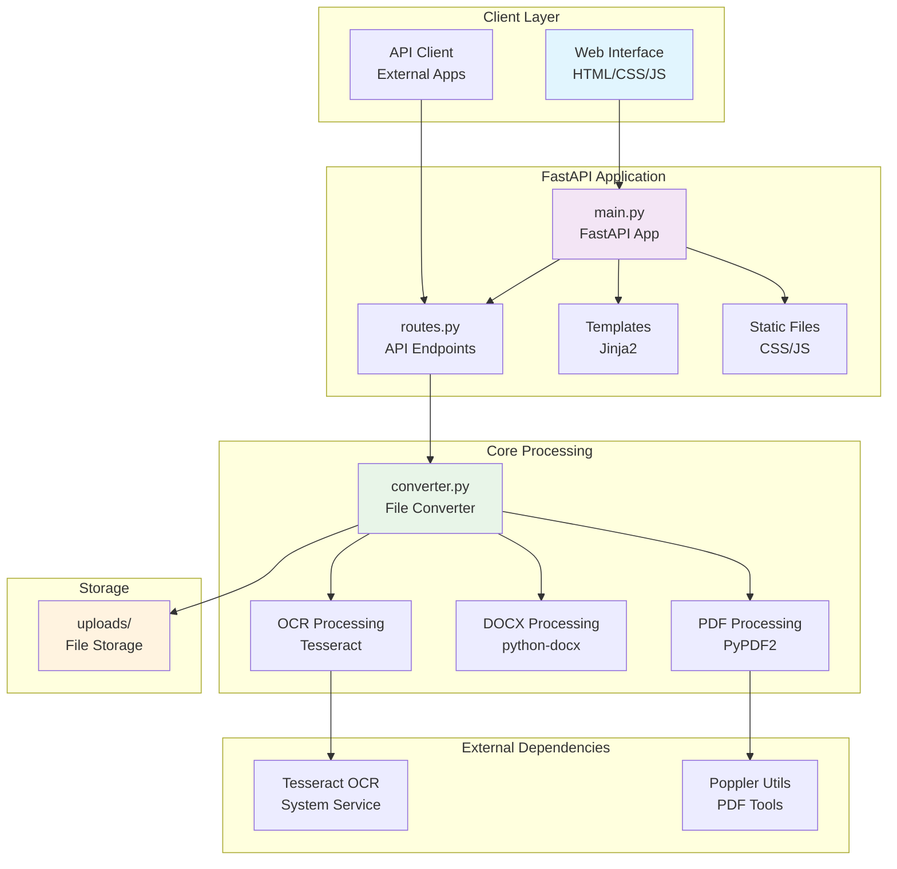

# File Converter Engine

A powerful, web-based file conversion service that transforms PDF, DOCX, and image files into plain text using OCR and document parsing technologies. Built with FastAPI and designed for easy deployment with Docker.

## 🚀 Features

- **Multi-format Support**: Convert PDF, DOCX, PNG, JPG, and JPEG files to text
- **OCR Technology**: Extract text from images using Tesseract OCR
- **Web Interface**: User-friendly web interface for file uploads
- **REST API**: RESTful API endpoints for programmatic access
- **Docker Ready**: Containerized for easy deployment
- **Fast Processing**: Built on FastAPI for high-performance file processing

## 🏗️ Architecture



## 📋 Requirements

- Python 3.9+
- Tesseract OCR
- Poppler utilities (for PDF processing)

### Python Dependencies
- FastAPI >= 0.95.0
- Uvicorn >= 0.21.0
- PyPDF2 >= 3.0.0
- python-docx >= 0.8.0
- pytesseract >= 0.3.0
- Pillow >= 10.0.0
- Jinja2 >= 3.0.0
- python-multipart >= 0.0.12

## 🐳 Quick Start with Docker

The easiest way to run the application is using Docker:

```bash
# Clone the repository
git clone <repository-url>
cd file-converter-engine

# Build and run with Docker
docker build -t file-converter-engine .
docker run -p 8080:80 file-converter-engine
```

The application will be available at `http://localhost:8080`

## 💻 Local Development

### Prerequisites

**macOS:**
```bash
brew install tesseract poppler
```

**Ubuntu/Debian:**
```bash
sudo apt-get update
sudo apt-get install tesseract-ocr libtesseract-dev poppler-utils
```

### Installation

1. **Clone the repository:**
   ```bash
   git clone <repository-url>
   cd file-converter-engine
   ```

2. **Create a virtual environment:**
   ```bash
   python -m venv venv
   source venv/bin/activate  # On Windows: venv\Scripts\activate
   ```

3. **Install dependencies:**
   ```bash
   pip install -r requirements.txt
   ```

4. **Run the development server:**
   ```bash
   uvicorn app.main:app --reload --host 0.0.0.0 --port 8000
   ```

5. **Access the application:**
   - Web Interface: `http://localhost:8000`
   - API Documentation: `http://localhost:8000/docs`

## 🔌 API Endpoints

### Convert File
```http
POST /api/convert
Content-Type: multipart/form-data

Body: file (multipart file upload)
```

**Response:**
```json
{
  "download_link": "/api/download/filename.txt"
}
```

### Download Converted File
```http
GET /api/download/{filename}
```

Returns the converted text file for download.

## 📁 Project Structure

```
file-converter-engine/
├── app/
│   ├── main.py              # FastAPI application entry point
│   ├── api/
│   │   └── routes.py        # API route definitions
│   ├── core/
│   │   └── converter.py     # File conversion logic
│   ├── static/
│   │   ├── script.js        # Frontend JavaScript
│   │   └── style.css        # Styling
│   └── templates/
│       └── index.html       # Web interface template
├── tests/
│   └── test_converter.py    # Unit tests
├── uploads/                 # File storage directory
├── Dockerfile              # Container configuration
├── requirements.txt        # Python dependencies
└── README.md               # This file
```

## 🧪 Testing

Run the test suite:

```bash
python -m pytest tests/ -v
```

## 🎯 Supported File Types

| Format | Extension | Processing Method |
|--------|-----------|-------------------|
| PDF | `.pdf` | PyPDF2 text extraction |
| Word Document | `.docx` | python-docx library |
| Images | `.png`, `.jpg`, `.jpeg` | Tesseract OCR |

## 🚀 Deployment

### Docker Deployment

```bash
# Build the image
docker build -t file-converter-engine .

# Run the container
docker run -d \
  --name file-converter \
  -p 80:80 \
  -v $(pwd)/uploads:/app/uploads \
  file-converter-engine
```

### Production Considerations

- Configure proper volume mounts for persistent file storage
- Set up reverse proxy (nginx) for production
- Implement file cleanup strategies for the uploads directory
- Add authentication and authorization as needed
- Monitor resource usage for large file processing

## 🤝 Contributing

1. Fork the repository
2. Create a feature branch (`git checkout -b feature/amazing-feature`)
3. Commit your changes (`git commit -m 'Add amazing feature'`)
4. Push to the branch (`git push origin feature/amazing-feature`)
5. Open a Pull Request

## 📄 License

This project is licensed under the MIT License - see the LICENSE file for details.

## 🔧 Troubleshooting

### Common Issues

**Tesseract not found:**
```bash
# macOS
brew install tesseract

# Ubuntu/Debian
sudo apt-get install tesseract-ocr
```

**PDF processing errors:**
```bash
# Install poppler utilities
# macOS
brew install poppler

# Ubuntu/Debian
sudo apt-get install poppler-utils
```

**Permission errors in uploads directory:**
```bash
mkdir -p uploads
chmod 755 uploads
```

## 📞 Support

For support and questions, please open an issue in the GitHub repository.
